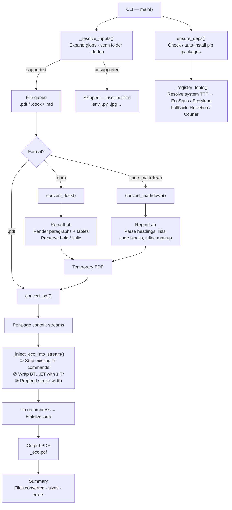

# Eco Font Converter

Save up to **33% printer ink** by converting documents to stroke-only text rendering — the same technique used by the [Ryman Eco](https://rymaneco.co.uk/) font.

Instead of filling each character solid, it draws only the outlines. The result looks identical on screen but uses significantly less ink when printed.

---

## Requirements

- Python 3.10+
- pip

Install core dependencies:

```bash
pip install pypdf reportlab
```

Optional (only needed for `.docx` files):

```bash
pip install python-docx
```

Or let the script install them automatically with `-y`.

---

## Usage

### Single file

```bash
python eco_font_converter.py report.pdf
python eco_font_converter.py notes.docx
python eco_font_converter.py README.md
```

Output is saved next to the input as `<name>_eco.pdf`.

### Custom output path

```bash
python eco_font_converter.py report.pdf --output report_print.pdf
python eco_font_converter.py report.pdf -o report_print.pdf
```

### Batch — multiple files or globs

```bash
python eco_font_converter.py *.pdf
python eco_font_converter.py *.pdf *.docx *.md
python eco_font_converter.py file1.pdf file2.docx
```

### Batch — entire folder

```bash
python eco_font_converter.py --folder ./reports
python eco_font_converter.py -f ./reports --output-dir ./eco_output
```

Processes all `.pdf`, `.docx`, `.md`, and `.markdown` files in the folder.

### Auto-install dependencies

```bash
python eco_font_converter.py report.pdf --auto-install
python eco_font_converter.py report.pdf -y
```

Installs any missing packages via pip before converting.

### Preview without converting

```bash
python eco_font_converter.py *.pdf --dry-run
```

Shows what files would be converted and where output would go, without touching anything.

### Interactive mode

Run with no arguments and the script will prompt you to enter a file path:

```bash
python eco_font_converter.py
```

Useful when launching from a desktop shortcut or double-clicking the file.

---

## All options

| Flag | Short | Default | Description |
|------|-------|---------|-------------|
| `--output` | `-o` | `<name>_eco.pdf` | Output path (single file only) |
| `--output-dir` | `-d` | same folder as input | Output folder for batch mode |
| `--folder` | `-f` | — | Process all supported files in a folder |
| `--stroke-width` | `-s` | `0.7` | Thickness of character outlines (see below) |
| `--auto-install` | `-y` | off | Auto-install missing pip packages |
| `--dry-run` | — | off | Preview without converting |

---

## Stroke width guide

The stroke width controls how thick the character outlines are.

| Range | Effect |
|-------|--------|
| `0.4 – 0.6` | Very light — maximum ink saving, may look faint |
| `0.7` | **Default** — good balance of readability and savings |
| `0.8 – 1.0` | More visible — easier to read, less saving |

```bash
# Lighter (save more ink)
python eco_font_converter.py report.pdf --stroke-width 0.5

# Heavier (easier to read)
python eco_font_converter.py report.pdf --stroke-width 0.9
```

---

## Supported formats

| Format | Notes |
|--------|-------|
| `.pdf` | Injects stroke-only rendering directly into the PDF stream |
| `.docx` | Extracts text and headings, renders to eco PDF |
| `.md` / `.markdown` | Parses Markdown including headings, bold, italic, code blocks, and lists |

---

## How it works

PDF files contain content streams — sequences of drawing commands. Text is typically rendered with mode `0` (fill). This script:

1. Decompresses each content stream
2. Removes any existing text rendering mode commands
3. Wraps every `BT...ET` text block with `1 Tr` (stroke-only mode) and sets a stroke width
4. Recompresses and writes the result

For DOCX and Markdown, the script first renders the content to a temporary PDF using ReportLab, then applies the same eco transformation.

---

## Architecture



---

## Examples

```bash
# Convert one PDF, default settings
python eco_font_converter.py quarterly_report.pdf

# Convert all PDFs in a folder, save to a separate output folder
python eco_font_converter.py --folder ./invoices --output-dir ./invoices_eco

# Very light strokes for maximum ink saving
python eco_font_converter.py brochure.pdf -s 0.5

# Convert a Word doc, auto-installing dependencies
python eco_font_converter.py proposal.docx -y

# Preview what a glob would convert
python eco_font_converter.py *.docx --dry-run
```
