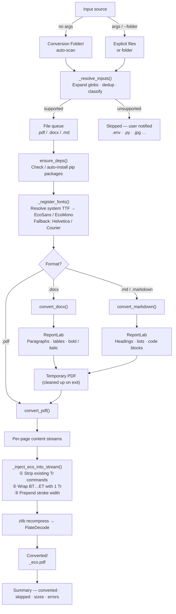

# Eco Font Converter

Save up to **33% printer ink** by converting documents to stroke-only text rendering — the same technique used by the [Ryman Eco](https://rymaneco.co.uk/) font.

Instead of filling each character solid, it draws only the outlines. The result looks identical on screen but uses significantly less ink when printed.

---

## Folder structure

```
EcoFONT Script/
├── eco_font_converter.py
├── Conversion Folder/   ← drop files here
└── Converted/           ← output lands here
```

**Drop files into `Conversion Folder/` and run the script — that's it.** Converted PDFs appear in `Converted/` automatically.

---

## Requirements

- Python 3.10+
- pip

Install core dependencies:

```bash
pip install pypdf reportlab
```

Optional (only needed for `.docx` files):

```bash
pip install python-docx
```

Or let the script install missing packages automatically with `-y`.

---

## Usage

### Default — no arguments

```bash
python eco_font_converter.py
```

Scans `Conversion Folder/`, converts all supported files, saves results to `Converted/`. Unsupported files are listed and skipped.

### Single file

```bash
python eco_font_converter.py report.pdf
python eco_font_converter.py notes.docx
python eco_font_converter.py README.md
```

Output goes to `Converted/<name>_eco.pdf`.

### Multiple files or globs

```bash
python eco_font_converter.py *.pdf *.docx *.md
python eco_font_converter.py file1.pdf file2.docx
```

### Custom input folder

```bash
python eco_font_converter.py --folder ./reports
python eco_font_converter.py -f ./reports --output-dir ./eco_output
```

### Preview without converting

```bash
python eco_font_converter.py --dry-run
python eco_font_converter.py *.pdf --dry-run
```

Shows what would be converted and where output would go — no files touched.

### Auto-install dependencies

```bash
python eco_font_converter.py -y
```

Installs any missing packages via pip before converting.

---

## All options

| Flag | Short | Default | Description |
|------|-------|---------|-------------|
| `--folder` | `-f` | `Conversion Folder/` | Input folder to scan |
| `--output` | `-o` | — | Output path (single file only) |
| `--output-dir` | `-d` | `Converted/` | Output folder |
| `--stroke-width` | `-s` | `0.7` | Outline thickness, range 0.1–3.0 |
| `--auto-install` | `-y` | off | Auto-install missing pip packages |
| `--dry-run` | — | off | Preview without converting |

---

## Stroke width guide

| Range | Effect |
|-------|--------|
| `0.1 – 0.6` | Very light — maximum ink saving, may look faint |
| `0.7` | **Default** — good balance of readability and savings |
| `0.8 – 3.0` | Heavier strokes — easier to read, less saving |

```bash
python eco_font_converter.py --stroke-width 0.5   # lighter
python eco_font_converter.py --stroke-width 0.9   # heavier
```

---

## Supported formats

| Format | What is preserved |
|--------|-------------------|
| `.pdf` | All content — eco mode injected directly into PDF streams |
| `.docx` | Headings, paragraphs, tables, bold, italic |
| `.md` / `.markdown` | Headings, bold, italic, inline code, code blocks, bullet and numbered lists |

Unsupported files (`.jpg`, `.xlsx`, `.env`, etc.) are listed and skipped — never cause errors.

---

## How it works

PDF files contain content streams — sequences of drawing commands. Text is normally rendered with mode `0` (solid fill). This script:

1. Decompresses each page's content stream
2. Strips any existing text rendering mode commands
3. Wraps every `BT...ET` text block with `1 Tr` (stroke-only) and sets the stroke width
4. Recompresses and writes the result

For DOCX and Markdown, the script first renders the content to a temporary PDF via ReportLab, then applies the same eco transformation. The temporary file is always cleaned up, even on failure.

---

## Architecture


